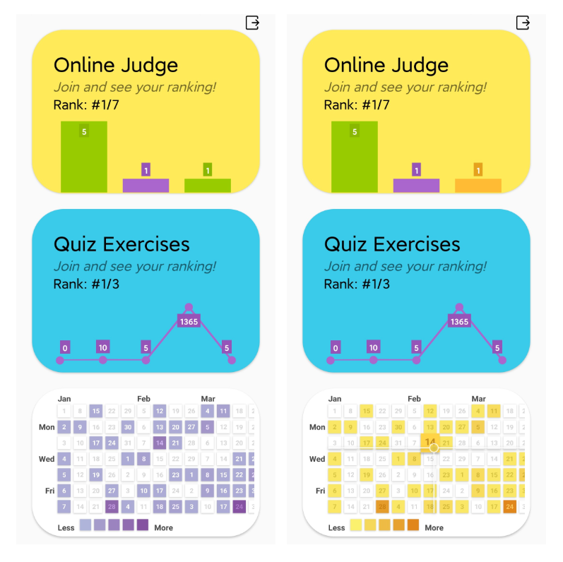
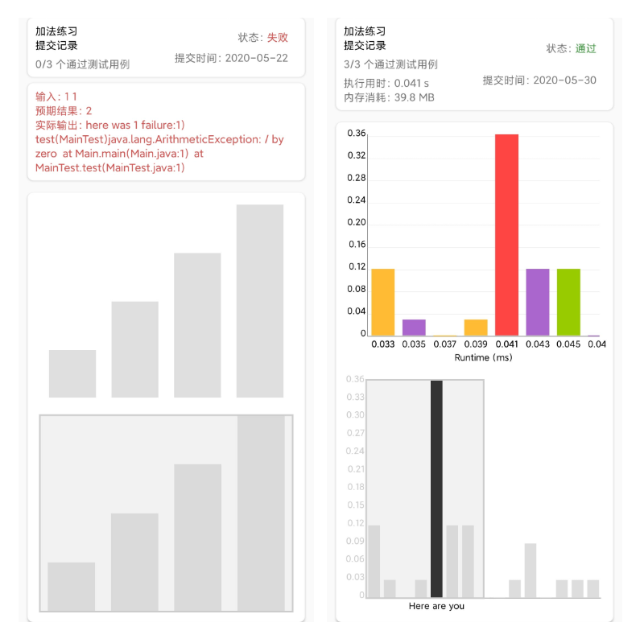

# OnlineOJ-Android
OnlineOJ Android 端项目源码

## Install🛠️
``` shell
$ gradlew clean
$ gradlew compileReleaseSources
```
[backend repository](https://github.com/CMW845751770/quiz)

## Try it🚀
[you can get demo here](https://www.sgxm.tech/wp-content/uploads/ojonline.apk)

## Screenshot📌




## Project Structure🔍
```
src
│      ├─androidTest
│      │  └─java
│      │      └─zq
│      │          └─tju
│      │              └─oj
│      │                      ExampleInstrumentedTest.kt
│      │                      
│      ├─main
│      │  │  AndroidManifest.xml
│      │  │  
│      │  ├─assets
│      │  │  └─font
│      │  │          din.otf
│      │  │          
│      │  ├─java
│      │  │  └─zq
│      │  │      └─tju
│      │  │          └─oj
│      │  │              │  LoginActivity.kt
│      │  │              │  MainActivity.kt
│      │  │              │  MyApplication.kt
│      │  │              │  
│      │  │              ├─model
│      │  │              │      SomeViewModel.kt
│      │  │              │      
│      │  │              ├─service
│      │  │              │      ServiceAPI.kt
│      │  │              │      
│      │  │              └─view
│      │  │                      items.kt
│      │  │                      OjDetailActivity.kt
│      │  │                      ProblemDetailActivity.kt
│      │  │                      QuizDetailActivity.kt
│      │  │                      SubmissionDetail.kt
│      │  │                      
│      │  └─res
│      │      ├─drawable
│      │      │      ic_launcher_background.xml
│      │      │      lb.png
│      │      │      login_back.jpg
│      │      │      rounded_edittext.xml
│      │      │      textview_circle_ac.xml
│      │      │      textview_circle_fa.xml
│      │      │      vector_drawable_exit.xml
│      │      │      
│      │      ├─drawable-v24
│      │      │      ic_launcher_foreground.xml
│      │      │      
│      │      ├─layout
│      │      │      activity_login.xml
│      │      │      activity_main.xml
│      │      │      activity_oj_detail.xml
│      │      │      activity_problem_detail.xml
│      │      │      activity_quiz_detail.xml
│      │      │      activity_submission_detail.xml
│      │      │      cell_info.xml
│      │      │      content_problem_detail.xml
│      │      │      oj_item_header.xml
│      │      │      oj_item_record.xml
│      │      │      quiz_item_error.xml
│      │      │      qz_item_header.xml
│      │      │      
│      │      ├─mipmap-anydpi-v26
│      │      │      ic_launcher.xml
│      │      │      ic_launcher_round.xml
│      │      │      
│      │      ├─mipmap-hdpi
│      │      │      ic_launcher.png
│      │      │      ic_launcher_round.png
│      │      │      
│      │      ├─mipmap-mdpi
│      │      │      ic_launcher.png
│      │      │      ic_launcher_round.png
│      │      │      
│      │      ├─mipmap-xhdpi
│      │      │      ic_launcher.png
│      │      │      ic_launcher_round.png
│      │      │      
│      │      ├─mipmap-xxhdpi
│      │      │      ic_launcher.png
│      │      │      ic_launcher_round.png
│      │      │      
│      │      ├─mipmap-xxxhdpi
│      │      │      ic_launcher.png
│      │      │      ic_launcher_round.png
│      │      │      
│      │      ├─values
│      │      │      colors.xml
│      │      │      dimens.xml
│      │      │      strings.xml
│      │      │      styles.xml
│      │      │      
│      │      └─xml
│      │              network_security_config.xml
│      │              
│      └─test
│          └─java
│              └─zq
│                  └─tju
│                      └─oj
│                              ExampleUnitTest.kt
```
## License📜
[MIT License](LICENSE)
